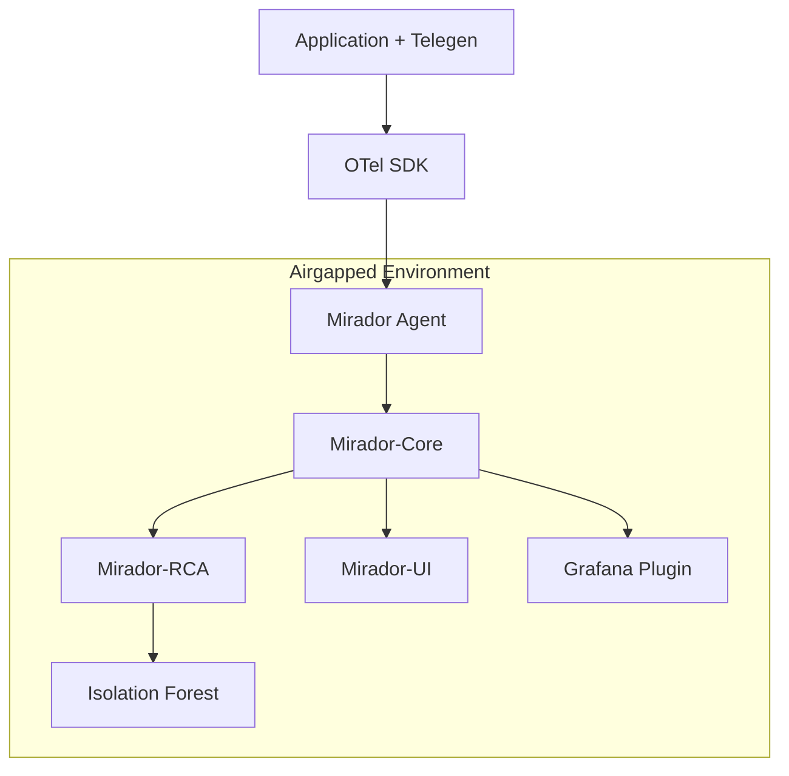

OpenTelemetry has emerged as the de facto standard for observability, providing a vendor-neutral way to instrument, generate, collect, and export telemetry data. At PlatformBuilds, we've built **MiradorStack** - a next-generation observability platform that deeply integrates with OpenTelemetry to provide privacy-first, airgapped observability for regulated industries.

This comprehensive guide walks through implementing OpenTelemetry in production with MiradorStack, covering everything from instrumentation strategy to deployment patterns in secure environments.

## Why OpenTelemetry + MiradorStack?

MiradorStack builds on OpenTelemetry's strengths while adding privacy-first capabilities essential for regulated industries:

### Privacy-First Architecture
- **Airgapped Deployments**: Complete data sovereignty with no external dependencies
- **Data Residency**: Keep sensitive telemetry data within your infrastructure
- **Compliance Ready**: Built for finance, healthcare, government, and defense sectors
- **Encrypted Everything**: End-to-end encryption for all telemetry data

### Enhanced OpenTelemetry Integration
- **Deep OTEL Support**: Native OpenTelemetry Protocol (OTLP) integration
- **Vendor Neutrality**: Standards-based approach prevents lock-in
- **Unified Telemetry**: Seamlessly correlate traces, metrics, and logs
- **Intelligent Processing**: ML-powered anomaly detection with Isolation Forest

### Enterprise Production Features
- **Scalable Architecture**: Designed for high-volume enterprise workloads
- **Reliability**: Battle-tested in regulated industry deployments
- **Cost Efficiency**: Open source with optimized resource utilization
- **Advanced Analytics**: Root Cause Analysis (RCA) and predictive insights

## MiradorStack Architecture Overview

MiradorStack extends the standard OpenTelemetry architecture with privacy-first components:



### MiradorStack Components

**Application + Telegen**: Universal telemetry agent eliminating multiple monitoring agents
**Mirador Agent**: Privacy-aware collector with encryption and data residency controls  
**Mirador-Core**: High-performance Go-based processing engine with OTLP support
**Mirador-RCA**: ML-powered root cause analysis with Isolation Forest anomaly detection
**Mirador-UI**: Modern TypeScript interface for unified observability dashboards
**Grafana Integration**: Native datasource plugin for existing Grafana deployments

## Implementation Strategy

### Phase 1: Foundation Setup

Start with basic tracing infrastructure:

```yaml
# otel-collector-config.yaml
receivers:
  otlp:
    protocols:
      grpc:
        endpoint: 0.0.0.0:4317
      http:
        endpoint: 0.0.0.0:4318
        
  # Host metrics for infrastructure monitoring
  hostmetrics:
    collection_interval: 30s
    scrapers:
      cpu: {}
      memory: {}
      disk: {}
      network: {}

processors:
  batch:
    timeout: 1s
    send_batch_size: 1024
    send_batch_max_size: 2048
    
  memory_limiter:
    limit_mib: 512
    
  # Add useful attributes
  resource:
    attributes:
      - key: environment
        value: production
        action: upsert
      - key: service.namespace
        from_attribute: k8s.namespace.name
        action: insert

exporters:
  # Traces to Jaeger
  jaeger:
    endpoint: jaeger-collector:14250
    tls:
      insecure: true
      
  # Metrics to Prometheus
  prometheus:
    endpoint: "0.0.0.0:8889"
    namespace: otel
    
  # Logs to Loki  
  loki:
    endpoint: http://loki:3100/loki/api/v1/push

service:
  pipelines:
    traces:
      receivers: [otlp]
      processors: [memory_limiter, batch, resource]
      exporters: [jaeger]
      
    metrics:
      receivers: [otlp, hostmetrics]
      processors: [memory_limiter, batch, resource]
      exporters: [prometheus]
      
    logs:
      receivers: [otlp]
      processors: [memory_limiter, batch, resource]
      exporters: [loki]
```

### Phase 2: Application Instrumentation

Implement auto and manual instrumentation:

#### Java Application Example

```java
// Application startup configuration
public class ObservabilityConfig {
    
    public static void initializeOpenTelemetry() {
        OpenTelemetry openTelemetry = OpenTelemetrySDK.builder()
            .setTracerProvider(
                SdkTracerProvider.builder()
                    .addSpanProcessor(BatchSpanProcessor.builder(
                        OtlpGrpcSpanExporter.builder()
                            .setEndpoint("http://otel-collector:4317")
                            .build())
                        .setMaxExportBatchSize(512)
                        .setExportTimeout(Duration.ofSeconds(2))
                        .setScheduleDelay(Duration.ofSeconds(1))
                        .build())
                    .setResource(Resource.getDefault()
                        .merge(Resource.builder()
                            .put(ResourceAttributes.SERVICE_NAME, "checkout-service")
                            .put(ResourceAttributes.SERVICE_VERSION, getVersion())
                            .put(ResourceAttributes.DEPLOYMENT_ENVIRONMENT, getEnvironment())
                            .build()))
                    .build())
            .setMeterProvider(
                SdkMeterProvider.builder()
                    .registerMetricReader(
                        PeriodicMetricReader.builder(
                            OtlpGrpcMetricExporter.builder()
                                .setEndpoint("http://otel-collector:4317")
                                .build())
                            .setInterval(Duration.ofSeconds(30))
                            .build())
                    .setResource(Resource.getDefault())
                    .build())
            .buildAndRegisterGlobal();
    }
}
```

#### Custom Business Metrics

```java
// Business-specific instrumentation
@Component
public class CheckoutInstrumentation {
    
    private final Meter meter;
    private final LongCounter checkoutAttempts;
    private final LongCounter checkoutSuccess;
    private final DoubleHistogram checkoutDuration;
    
    public CheckoutInstrumentation() {
        this.meter = GlobalOpenTelemetry.getMeter("checkout-service");
        
        this.checkoutAttempts = meter
            .counterBuilder("checkout.attempts")
            .setDescription("Total checkout attempts")
            .build();
            
        this.checkoutSuccess = meter
            .counterBuilder("checkout.success")
            .setDescription("Successful checkouts")
            .build();
            
        this.checkoutDuration = meter
            .histogramBuilder("checkout.duration")
            .setDescription("Checkout processing time")
            .setUnit("ms")
            .build();
    }
    
    public void recordCheckoutAttempt(String paymentMethod, String userTier) {
        checkoutAttempts.add(1, 
            Attributes.of(
                AttributeKey.stringKey("payment.method"), paymentMethod,
                AttributeKey.stringKey("user.tier"), userTier));
    }
    
    public void recordCheckoutSuccess(String paymentMethod, double durationMs) {
        checkoutSuccess.add(1, 
            Attributes.of(AttributeKey.stringKey("payment.method"), paymentMethod));
        checkoutDuration.record(durationMs,
            Attributes.of(AttributeKey.stringKey("payment.method"), paymentMethod));
    }
}
```

#### Distributed Tracing Patterns

```java
// Manual span creation for business logic
@Service
public class PaymentService {
    
    private final Tracer tracer = GlobalOpenTelemetry.getTracer("payment-service");
    
    public PaymentResult processPayment(PaymentRequest request) {
        Span span = tracer.spanBuilder("payment.process")
            .setSpanKind(SpanKind.INTERNAL)
            .startSpan();
            
        try (Scope scope = span.makeCurrent()) {
            // Add business context to span
            span.setAllAttributes(Attributes.of(
                AttributeKey.stringKey("payment.method"), request.getMethod(),
                AttributeKey.stringKey("payment.currency"), request.getCurrency(),
                AttributeKey.doubleKey("payment.amount"), request.getAmount(),
                AttributeKey.stringKey("user.id"), request.getUserId()));
            
            // Process payment
            PaymentResult result = doPaymentProcessing(request);
            
            // Record outcome
            span.setAllAttributes(Attributes.of(
                AttributeKey.stringKey("payment.status"), result.getStatus(),
                AttributeKey.stringKey("payment.transaction_id"), result.getTransactionId()));
                
            if (result.isSuccessful()) {
                span.setStatus(StatusCode.OK);
            } else {
                span.setStatus(StatusCode.ERROR, result.getErrorMessage());
            }
            
            return result;
            
        } catch (Exception e) {
            span.recordException(e);
            span.setStatus(StatusCode.ERROR, e.getMessage());
            throw e;
        } finally {
            span.end();
        }
    }
}
```

### Phase 3: Advanced Collector Configuration

Implement production-ready collector features:

```yaml
# production-collector-config.yaml
receivers:
  otlp:
    protocols:
      grpc:
        endpoint: 0.0.0.0:4317
        max_recv_msg_size: 67108864  # 64MB
      http:
        endpoint: 0.0.0.0:4318
        
  # Kubernetes events and metadata
  k8s_events:
    auth_type: serviceAccount
    
  k8s_cluster:
    auth_type: serviceAccount
    collection_interval: 10s

processors:
  # Performance and reliability
  memory_limiter:
    check_interval: 1s
    limit_percentage: 75
    spike_limit_percentage: 15
    
  batch:
    timeout: 1s
    send_batch_size: 1024
    send_batch_max_size: 2048
    
  # Data enrichment
  k8sattributes:
    auth_type: serviceAccount
    passthrough: false
    filter:
      node_from_env_var: KUBE_NODE_NAME
    extract:
      metadata:
        - k8s.pod.name
        - k8s.pod.uid
        - k8s.deployment.name
        - k8s.namespace.name
        - k8s.node.name
        - k8s.pod.start_time
      labels:
        - tag_name: app.label.component
          key: app.kubernetes.io/component
          from: pod
    pod_association:
      - sources:
        - from: resource_attribute
          name: k8s.pod.ip
      - sources:
        - from: resource_attribute
          name: k8s.pod.uid
      - sources:
        - from: connection
          
  # Sampling for high-volume services
  probabilistic_sampler:
    hash_seed: 22
    sampling_percentage: 15.3
    
  # Tail-based sampling for intelligent retention
  tail_sampling:
    decision_wait: 30s
    num_traces: 50000
    expected_new_traces_per_sec: 10
    policies:
      - name: errors_policy
        type: status_code
        status_code: {status_codes: [ERROR]}
      - name: slow_requests
        type: latency
        latency: {threshold_ms: 1000}
      - name: random_sampling
        type: probabilistic
        probabilistic: {sampling_percentage: 1}

  # Resource detection
  resourcedetection:
    detectors: [env, system, ec2, gcp, azure, ecs, eks]
    timeout: 5s
    
exporters:
  # Jaeger for traces
  jaeger:
    endpoint: jaeger-collector.observability.svc.cluster.local:14250
    tls:
      insecure: true
    retry_on_failure:
      enabled: true
      initial_interval: 1s
      max_interval: 60s
      max_elapsed_time: 10m
      
  # Prometheus for metrics
  prometheusremotewrite:
    endpoint: http://prometheus.observability.svc.cluster.local:9090/api/v1/write
    retry_on_failure:
      enabled: true
    
  # Multiple backends with load balancing
  loadbalancing:
    protocol:
      otlp:
        endpoint: otel-collector-gateway
    resolver:
      static:
        hostnames:
          - otel-collector-gateway-0.otel-collector-gateway
          - otel-collector-gateway-1.otel-collector-gateway

service:
  extensions: [health_check, pprof, zpages]
  
  pipelines:
    traces:
      receivers: [otlp]
      processors: [memory_limiter, k8sattributes, resourcedetection, tail_sampling, batch]
      exporters: [jaeger, loadbalancing]
      
    metrics:
      receivers: [otlp, k8s_cluster]
      processors: [memory_limiter, k8sattributes, resourcedetection, batch]
      exporters: [prometheusremotewrite]
      
    logs:
      receivers: [otlp, k8s_events]
      processors: [memory_limiter, k8sattributes, resourcedetection, batch]
      exporters: [loki]
```

## Performance Optimization

### SDK Configuration

Optimize SDK performance for production:

```yaml
# SDK environment variables for optimal performance
OTEL_BSP_SCHEDULE_DELAY: 1000              # 1 second batch delay
OTEL_BSP_MAX_EXPORT_BATCH_SIZE: 512        # Batch size
OTEL_BSP_EXPORT_TIMEOUT: 30000             # 30 second timeout
OTEL_BSP_MAX_QUEUE_SIZE: 2048              # Queue size

# Resource limits
OTEL_RESOURCE_ATTRIBUTES: service.name=my-service,service.version=1.0.0
OTEL_SPAN_ATTRIBUTE_COUNT_LIMIT: 128       # Limit span attributes
OTEL_SPAN_LINK_COUNT_LIMIT: 128            # Limit span links
OTEL_EVENT_ATTRIBUTE_COUNT_LIMIT: 128      # Limit event attributes
```

### Sampling Strategies

Implement intelligent sampling:

```go
// Custom sampling logic
package sampling

import (
    "context"
    "go.opentelemetry.io/otel/trace"
    "go.opentelemetry.io/otel/sdk/trace"
)

type BusinessLogicSampler struct {
    fallbackSampler trace.Sampler
}

func (s BusinessLogicSampler) ShouldSample(parameters trace.SamplingParameters) trace.SamplingResult {
    // Always sample error spans
    if parameters.Attributes != nil {
        for _, attr := range parameters.Attributes {
            if attr.Key == "error" && attr.Value.AsBool() {
                return trace.SamplingResult{
                    Decision: trace.RecordAndSample,
                }
            }
        }
    }
    
    // Always sample high-value operations
    switch parameters.Name {
    case "checkout.process", "payment.charge", "user.authenticate":
        return trace.SamplingResult{
            Decision: trace.RecordAndSample,
        }
    }
    
    // Use fallback sampling for other operations
    return s.fallbackSampler.ShouldSample(parameters)
}
```

### Memory Management

Configure memory limits and GC:

```yaml
# Kubernetes deployment with proper resource limits
apiVersion: apps/v1
kind: Deployment
metadata:
  name: otel-collector
spec:
  replicas: 3
  template:
    spec:
      containers:
      - name: otel-collector
        image: otel/opentelemetry-collector-contrib:latest
        resources:
          requests:
            memory: "256Mi"
            cpu: "100m"
          limits:
            memory: "512Mi"
            cpu: "500m"
        env:
        - name: GOGC
          value: "80"  # More frequent GC
        - name: GOMEMLIMIT  
          value: "450MiB"  # Memory limit for Go runtime
```

## Production Deployment Patterns

### Kubernetes Deployment

Deploy collectors using DaemonSet and StatefulSet patterns:

```yaml
# Agent DaemonSet for node-level collection
apiVersion: apps/v1
kind: DaemonSet
metadata:
  name: otel-collector-agent
  namespace: observability
spec:
  selector:
    matchLabels:
      app: otel-collector-agent
  template:
    metadata:
      labels:
        app: otel-collector-agent
    spec:
      serviceAccountName: otel-collector
      containers:
      - name: otel-collector
        image: otel/opentelemetry-collector-contrib:latest
        args: ["--config=/etc/otel/config.yaml"]
        ports:
        - containerPort: 4317  # OTLP gRPC
        - containerPort: 4318  # OTLP HTTP
        - containerPort: 8889  # Prometheus metrics
        volumeMounts:
        - name: config
          mountPath: /etc/otel
        env:
        - name: KUBE_NODE_NAME
          valueFrom:
            fieldRef:
              fieldPath: spec.nodeName
        resources:
          requests:
            memory: "128Mi"
            cpu: "50m"
          limits:
            memory: "256Mi"
            cpu: "200m"
      volumes:
      - name: config
        configMap:
          name: otel-collector-agent-config
      tolerations:
      - operator: "Exists"  # Run on all nodes including masters
```

```yaml
# Gateway StatefulSet for centralized processing
apiVersion: apps/v1
kind: StatefulSet
metadata:
  name: otel-collector-gateway
  namespace: observability
spec:
  serviceName: otel-collector-gateway
  replicas: 3
  selector:
    matchLabels:
      app: otel-collector-gateway
  template:
    metadata:
      labels:
        app: otel-collector-gateway
    spec:
      containers:
      - name: otel-collector
        image: otel/opentelemetry-collector-contrib:latest
        args: ["--config=/etc/otel/config.yaml"]
        ports:
        - containerPort: 4317
        - containerPort: 4318
        - containerPort: 8888  # Health check
        - containerPort: 8889  # Prometheus metrics
        livenessProbe:
          httpGet:
            path: /
            port: 8888
          initialDelaySeconds: 30
          periodSeconds: 10
        readinessProbe:
          httpGet:
            path: /
            port: 8888
          initialDelaySeconds: 5
          periodSeconds: 5
        resources:
          requests:
            memory: "512Mi"
            cpu: "200m"
          limits:
            memory: "1Gi"
            cpu: "1000m"
        volumeMounts:
        - name: config
          mountPath: /etc/otel
      volumes:
      - name: config
        configMap:
          name: otel-collector-gateway-config
```

### Service Discovery and Load Balancing

Configure automatic service discovery:

```yaml
# Service for load balancing
apiVersion: v1
kind: Service
metadata:
  name: otel-collector-gateway
  namespace: observability
spec:
  clusterIP: None  # Headless service for StatefulSet
  selector:
    app: otel-collector-gateway
  ports:
  - name: otlp-grpc
    port: 4317
  - name: otlp-http
    port: 4318
```

## Monitoring and Alerting

### Collector Health Monitoring

Monitor collector performance and health:

```yaml
# Prometheus monitoring rules
groups:
- name: otel-collector
  rules:
  - alert: OTelCollectorDown
    expr: up{job="otel-collector"} == 0
    for: 5m
    labels:
      severity: critical
    annotations:
      summary: "OpenTelemetry Collector is down"
      
  - alert: OTelCollectorHighMemoryUsage
    expr: process_resident_memory_bytes{job="otel-collector"} / 1024 / 1024 > 400
    for: 5m
    labels:
      severity: warning
    annotations:
      summary: "OpenTelemetry Collector high memory usage"
      
  - alert: OTelCollectorHighDropRate
    expr: rate(otelcol_processor_dropped_spans_total[5m]) > 10
    for: 2m
    labels:
      severity: critical
    annotations:
      summary: "OpenTelemetry Collector dropping spans"
      
  - alert: OTelCollectorQueueFull
    expr: otelcol_exporter_queue_size / otelcol_exporter_queue_capacity > 0.8
    for: 1m
    labels:
      severity: warning
    annotations:
      summary: "OpenTelemetry Collector export queue nearly full"
```

### Business Metrics Monitoring

Monitor application-level observability:

```yaml
# Application SLI monitoring
groups:
- name: application-slis
  rules:
  - alert: HighErrorRate
    expr: rate(http_requests_total{status=~"5.."}[5m]) / rate(http_requests_total[5m]) > 0.05
    for: 2m
    labels:
      severity: critical
    annotations:
      summary: "High error rate detected"
      
  - alert: HighLatency
    expr: histogram_quantile(0.95, rate(http_request_duration_seconds_bucket[5m])) > 1
    for: 5m
    labels:
      severity: warning
    annotations:
      summary: "High latency detected"
      
  - alert: TracingDataLoss
    expr: increase(otelcol_processor_dropped_spans_total[10m]) > 100
    for: 0m
    labels:
      severity: critical
    annotations:
      summary: "Significant tracing data loss detected"
```

## Security Considerations

### Authentication and Authorization

Secure collector endpoints:

```yaml
# TLS and authentication configuration
extensions:
  oauth2client:
    client_id: otel-collector
    client_secret: ${OAUTH_CLIENT_SECRET}
    token_url: https://auth.example.com/oauth/token
    
receivers:
  otlp:
    protocols:
      grpc:
        endpoint: 0.0.0.0:4317
        tls:
          cert_file: /etc/ssl/certs/otel-collector.crt
          key_file: /etc/ssl/private/otel-collector.key
          ca_file: /etc/ssl/certs/ca.crt
          client_ca_file: /etc/ssl/certs/client-ca.crt
        auth:
          authenticator: oauth2client

exporters:
  jaeger:
    endpoint: jaeger-collector:14250
    tls:
      cert_file: /etc/ssl/certs/client.crt
      key_file: /etc/ssl/private/client.key
      ca_file: /etc/ssl/certs/ca.crt
```

### Data Privacy

Implement data scrubbing and PII protection:

```yaml
processors:
  # Remove sensitive attributes
  attributes:
    actions:
      - key: user.email
        action: delete
      - key: user.ssn
        action: delete
      - key: http.request.header.authorization
        action: delete
      - key: http.request.header.cookie
        action: delete
        
  # Transform sensitive data
  transform:
    metric_statements:
      - context: datapoint
        statements:
          # Hash user IDs instead of storing plaintext
          - set(attributes["user.id"], SHA256(attributes["user.id"])) where attributes["user.id"] != nil
```

## Troubleshooting Common Issues

### Performance Problems

Debug collector performance issues:

```bash
# Check collector metrics
curl http://otel-collector:8888/metrics | grep -E "(queue|drop|memory)"

# Check resource usage
kubectl top pods -n observability -l app=otel-collector

# Analyze trace sampling
kubectl logs -n observability deployment/otel-collector-gateway | grep -i "sampling"
```

### Data Loss Investigation

Identify and fix data loss:

```bash
# Check for dropped spans/metrics
kubectl logs -n observability deployment/otel-collector | grep -i "drop\|reject\|fail"

# Monitor queue sizes
curl -s http://otel-collector:8888/metrics | grep otelcol_exporter_queue

# Check backend connectivity
kubectl exec -n observability deployment/otel-collector -- wget -O- http://jaeger-collector:14268/api/v1/health
```

## Best Practices Summary

1. **Start Simple**: Begin with basic tracing, add complexity gradually
2. **Monitor Everything**: Collector health is as important as application metrics  
3. **Optimize Performance**: Use appropriate sampling, batching, and resource limits
4. **Plan for Scale**: Design for growth with proper resource allocation
5. **Secure by Default**: Implement TLS and authentication from the start
6. **Test Thoroughly**: Validate observability in staging environments
7. **Document Operations**: Maintain runbooks for common scenarios

## Conclusion

Implementing OpenTelemetry in production with privacy-first requirements demands specialized solutions. MiradorStack provides the perfect bridge between OpenTelemetry's vendor-neutral standards and the strict data sovereignty needs of regulated industries.

Our approach combines:
- **Open Source Freedom**: Apache 2.0 licensing with full source access
- **Privacy by Design**: Airgapped deployments with complete data residency
- **Enterprise Scale**: Production-grade performance and reliability
- **Intelligent Analytics**: ML-powered insights with Isolation Forest anomaly detection

The future of observability is privacy-first, and MiradorStack is leading that transformation.

## Get Started with MiradorStack

Ready to implement privacy-first observability in your environment?

- **Explore**: [MiradorStack on GitHub](https://github.com/platformbuilds/miradorstack)
- **Deploy**: [Telegen Universal Agent](https://github.com/platformbuilds/telegen)  
- **Analyze**: [Mirador-RCA Root Cause Analysis](https://github.com/platformbuilds/mirador-rca)
- **Visualize**: [Grafana Datasource Plugin](https://github.com/platformbuilds/miradorstack-grafana-datasource)

Join our community and contribute to the future of privacy-first observability! All projects are open source under Apache 2.0 license.

---

*Building the next generation of privacy-first observability platforms for regulated industries. [Follow us on GitHub](https://github.com/platformbuilds) for the latest updates.*